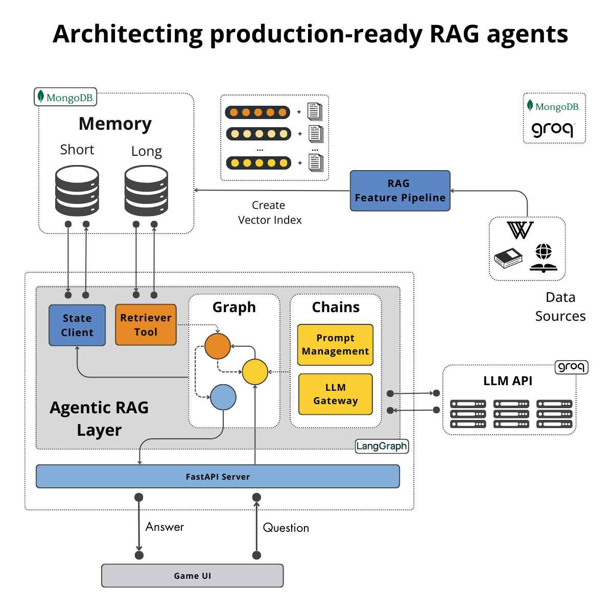
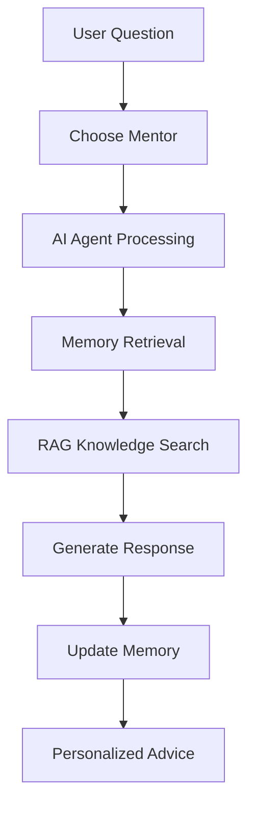
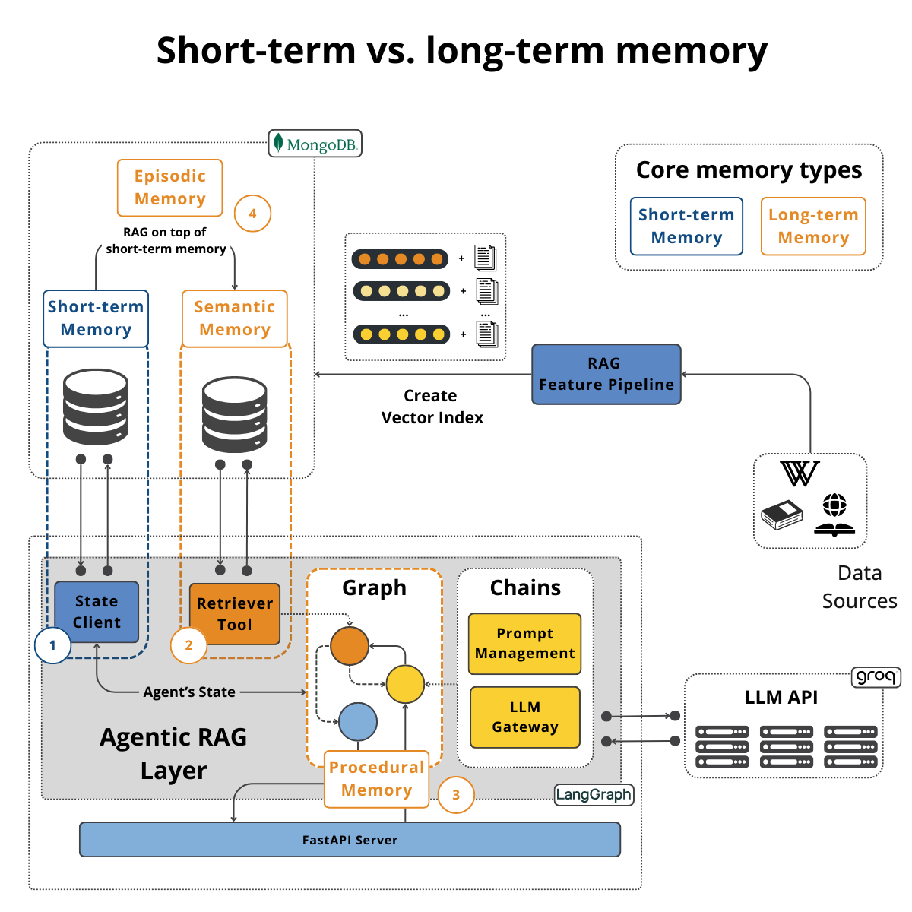

<div align="center">
  <h1>🧠 MentorAgents</h1>
  <h3>Your personal mentors, anytime. Anywhere.</h3>
  <h4>A Production-ready RAG, LLM and LLMOps system</h4>
  
  <p>MentorAgents is an AI-powered platform where users interact with agents modeled after legendary real-world experts—like Naval Ravikant and Warren Buffett. <br> Ask questions, get tailored guidance, and learn from the best minds — anytime, anywhere.</p>

  <p align="center">
    
  </p>

  [](https://opensource.org/licenses/MIT)
  [](https://www.python.org/downloads/)
  [](https://fastapi.tiangolo.com/)
  [](https://www.mongodb.com/)
</div>

---

## 📋 Table of Contents

- [✨ Key Features](#-key-features)
- [🛠 Tech Stack](#-tech-stack)
- [🚀 Getting Started](#-getting-started)
- [🤖 Mentor Profiles](#-mentor-profiles)
- [💬 How It Works](#-how-it-works)
- [🧠 Memory System](#-memory-system)
- [🔧 Configuration](#-configuration)
- [🤝 Contributing](#-contributing)
- [📄 License](#-license)
- [📧 Contact & Support](#-contact--support)

---

## ✨ Key Features

- 🎯 **Legendary Mentor AI Agents**: Chat with AI versions of famous investors and thought leaders
- 🧠 **Intelligent Memory System**: Both short-term and long-term memory capabilities using MongoDB
- 📚 **RAG-Powered Knowledge**: Vector database containing comprehensive mentor profiles and wisdom
- ⚡ **Real-time Conversations**: Fast and responsive chat interface powered by FastAPI
- 🎨 **Personalized Insights**: Get tailored advice based on your specific questions and context
- 📊 **Evaluation & Monitoring**: Built-in evaluation system with LLMOps observability

---

## 🛠 Tech Stack

### Backend
| Technology | Purpose |
|------------|---------|
| **FastAPI** | High-performance Python web framework |
| **LangGraph** | Advanced AI agent orchestration with memory management |
| **LangChain** | LLM integration and RAG implementation |
| **MongoDB** | Persistent storage for memory and state management |
| **Vector Database** | Semantic search for mentor knowledge retrieval |
| **Groq** | Fast LLM inference |
| **Sentence Transformers** | Text embeddings for RAG |
| **OPIK** | LLM Ops and evaluation|
| **Knowledge base** | Wikipedia, PDF, Youtube, Twitter |

### Frontend (Coming Soon)
- **React** - Modern frontend framework
- **Interactive UI** - Gamified chat experience

### 🏗 Architecture Components

1. **🤖 AI Agent Layer**: LangGraph manages intelligent conversations with mentor personalities
2. **🧠 Memory Management**: 
   - Short-term memory for conversation context
   - Long-term memory for user preferences and history
3. **📖 Knowledge Retrieval**: RAG system pulls relevant mentor insights from vector database
4. **🔌 API Layer**: FastAPI provides high-performance backend services
5. **💾 Data Persistence**: MongoDB stores conversation history and agent states

---

## 🚀 Getting Started

### Prerequisites

Before you begin, ensure you have the following installed:

- 🐍 **Python 3.11+**
- 📦 **Node.js 16+** (for future frontend)
- 🍃 **MongoDB instance**
- 🔑 **Groq API key**

### 🔧 Backend Setup

1. **📥 Clone the repository**
   ```bash
   git clone https://github.com/shubhamprajapati7748/mentoragents.git
   cd mentoragents/backend
   ```

2. **📦 Install dependencies**
   ```bash
   # Using uv (recommended)
   uv install

   # Or using pip
   pip install -e .
   ```

3. **⚙️ Environment Configuration**
   ```bash
   cp .env.example .env
   # Edit .env with your API keys and configuration
   ```

   Required environment variables:
   - `GROQ_API_KEY`: Your Groq API key
   - `MONGODB_URI`: MongoDB connection string
   - `OPIK_API_KEY`: Opik observability key (optional)

4. **🧠 Initialize Long-term Memory**
   ```bash
   # Save mentors to MongoDB
   python src/mentoragents/tools/save_mentors_into_mongodb.py
   
   # Create long-term memory
   python src/mentoragents/tools/create_long_term_memory.py
   ```

5. **🚀 Run the backend**
   ```bash
   uvicorn mentoragents.main:app --reload --host 127.0.0.1 --port 8080
   ```

   - 🌐 **API**: `http://127.0.0.1:8080`
   - 📖 **API Docs**: `http://127.0.0.1:8080/docs`

### 🧪 Optional: Evaluation & Testing

```bash
# Generate evaluation dataset
python src/mentoragents/tools/generate_evaluation_data.py

# Evaluate agent performance
python src/mentoragents/tools/evaluate_langraph_agent.py

# Clean up (if needed)
python src/mentoragents/tools/delete_long_term_memory.py
```

---

## 🤖 Mentor Profiles

Our growing library of legendary mentors includes:

| Mentor | Expertise | Specialization |
|--------|-----------|----------------|
| **Naval Ravikant** | Entrepreneurship | Philosophy, Angel Investing |
| **Warren Buffett** | Investing | Value Investing, Business Analysis |
| **Ray Dalio** | Finance | Macro Investing, Economic Cycles |
| **Charlie Munger** | Investing | Mental Models, Rational Thinking |
| **Benjamin Graham** | Finance | Value Investing, Financial Analysis |
| **And many more...** | Various | Expanding mentor library |

---

## 💬 How It Works



1. **🎯 Choose Your Mentor**: Select from available mentor personalities
2. **❓ Ask Your Question**: Type your question or describe your challenge
3. **🤖 Get Personalized Advice**: The AI agent retrieves relevant knowledge and provides mentor-style guidance
4. **💬 Continue the Conversation**: Build on previous discussions with persistent memory

---

## 🧠 Memory System

<div align="center">
  
</div>

### Memory Types
- **🔄 Short-term Memory**: Maintains conversation context within sessions
- **💾 Long-term Memory**: Remembers user preferences, past topics, and learning progress
- **📚 Knowledge Base**: Continuously updated mentor profiles and experiences

---

## 🔧 Configuration

Key configuration options in `backend/src/mentoragents/core/config.py`:

```python
# RAG Settings
EMBEDDING_MODEL = "sentence-transformers/all-MiniLM-L6-v2"
CHUNK_SIZE = 1000
RETRIEVAL_LIMIT = 5

# Database Settings
MONGODB_COLLECTION = "mentors"
```

---

## 🤝 Contributing

We welcome contributions! Please see our [Contributing Guidelines](CONTRIBUTING.md) for details.

### Getting Started
1. 🍴 Fork the repository
2. 🌿 Create a feature branch (`git checkout -b feature/amazing-feature`)
3. 💾 Commit your changes (`git commit -m 'Add amazing feature'`)
4. 🚀 Push to the branch (`git push origin feature/amazing-feature`)
5. 🔄 Open a Pull Request

### Areas for Contribution
- 🤖 New mentor personalities
- 📚 Knowledge base expansion
- 🎨 Frontend development
- 🧪 Testing and evaluation
- 📖 Documentation improvements

---

## 📄 License

This project is licensed under the MIT License - see the [LICENSE](LICENSE) file for details.

---

## 🙏 Acknowledgments

- 🦜 LangChain and LangGraph communities for AI agent frameworks
- 🧠 The mentors whose wisdom inspired this project
- 💻 Open source contributors making AI accessible
- 🌟 The amazing Python and AI/ML community

---

## 📧 Contact & Support

<div align="center">
  
  **Questions? Ideas? Let's connect!**
  
  📧 **Email**: [shubhamprajapati7748@gmail.com](mailto:shubhamprajapati7748@gmail.com)
  
  🐙 **GitHub**: [shubhamprajapati7748](https://github.com/shubhamprajapati7748)
  
  ---
  
  **Ready to learn from the best? Start your mentorship journey today!** 🚀
  
</div>

